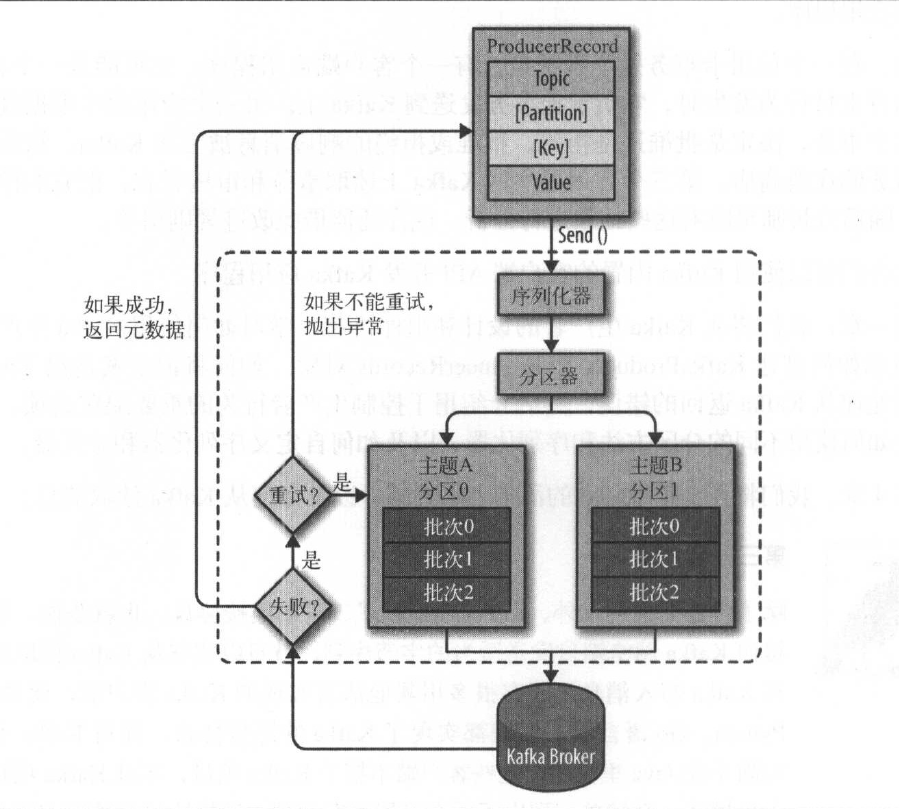

<!-- MarkdownTOC -->

- [生产者概览](#%E7%94%9F%E4%BA%A7%E8%80%85%E6%A6%82%E8%A7%88)
- [创建Kafka生产者](#%E5%88%9B%E5%BB%BAkafka%E7%94%9F%E4%BA%A7%E8%80%85)
- [发送消息到Kafka](#%E5%8F%91%E9%80%81%E6%B6%88%E6%81%AF%E5%88%B0kafka)
    - [1. 直接发送不关心返回](#1-%E7%9B%B4%E6%8E%A5%E5%8F%91%E9%80%81%E4%B8%8D%E5%85%B3%E5%BF%83%E8%BF%94%E5%9B%9E)
    - [2. 同步发送](#2-%E5%90%8C%E6%AD%A5%E5%8F%91%E9%80%81)
    - [3. 异步发送](#3-%E5%BC%82%E6%AD%A5%E5%8F%91%E9%80%81)
- [生产者配置](#%E7%94%9F%E4%BA%A7%E8%80%85%E9%85%8D%E7%BD%AE)
    - [序列化器](#%E5%BA%8F%E5%88%97%E5%8C%96%E5%99%A8)
        - [自定义序列化器](#%E8%87%AA%E5%AE%9A%E4%B9%89%E5%BA%8F%E5%88%97%E5%8C%96%E5%99%A8)
        - [使用Avro序列化](#%E4%BD%BF%E7%94%A8avro%E5%BA%8F%E5%88%97%E5%8C%96)
    - [分区](#%E5%88%86%E5%8C%BA)

<!-- /MarkdownTOC -->


# 生产者概览

<div align="center">  </div><br>

# 创建Kafka生产者
要往Kafka 写入消息，首先要创建一个生产者对象，井设置一些属性。Kafka 生产者有3
个必选的属性。

- bootstrap.service

    该属性指定broker的地址清单，地址的格式为`host:port`。清单里不需要包含所有的broker地址，生产者会从给定的broker里查找到其他broker的信息。不过建议至少要提供两个broker的信息，一且其中一个若机，生产者仍然能够连接到集群上。

- key.serializer

    broker希望接收到的消息的键和值都是字节数组。生产者接口允许使用参数化类型，因此可以把Java对象作为键和值发送给broker。这样的代码具有良好的可读性，不过生产者需要知道如何把这些Java对象转换成字节数组。key.serializer必须被设置为一个实现了。org.apache.kafka.common.serialization.Serializer接口的类，生产者会使用这个类把键对象序列化成字节数组。Kafka客户端默认提供了ByteArraySerializer（这个只做很少的事情）、StringSerializer和IntegerSerializer，因此，如果你只使用常见的几种Java对象类型，那么就没必要实现自己的序列化器。要注意，key.serializer是必须设置的，就算你打算只发送值内容。

- value.serializer

    与key.serializer一样，value.serializer指定的类会将值序列化。如果键和值都是字符串，可以使用与key.serivalizer一样的序列化器。如果键是整数类型而值是字符串那么需要使用不同的序列化器。

# 发送消息到Kafka
kafka生产者主要有3中消息发送方式：

## 1. 直接发送不关心返回
    producer把消息发送给服务器，但并不关心它是否正常达到。这种方式大多数情况下消息会正常达到，但有时候后也会存在消息的丢失

```java
        //最精简的配置项
        Properties properties = new Properties();
        properties.put("bootstrap.servers", "192.168.8.129:9092");
        properties.put("key.serializer", "org.apache.kafka.common.serialization.StringSerializer");
        properties.put("value.serializer", "org.apache.kafka.common.serialization.StringSerializer");
        Producer<String, String> producer = new KafkaProducer<String, String>(properties);

        ProducerRecord<String, String> record = new ProducerRecord<String, String>("test","say hello2!");
        try{
            producer.send(record);
        }catch (Exception e){
            e.printStackTrace();
        }finally {
            producer.close();//close必须要
        }
```

- 使用生产者的send()方法发送ProducerRecord对象，从生产者的组件架构图中可以看到，消息先是被放进缓冲区，然后使用单独的线程发送到服务器端。send()方法会返回一个包含RecordMetadata的Future对象，在这里我们直接忽略该返回值，所以无法知道消息是否发送成功，如果不关心发送结果就可以使用这种方式。比如，记录一些不太重要的应用程序日志。

- 虽然我们忽略了消息的返回，即对消消息发送的异常做了忽略。但是在发送消息之前，生产者还是可能会发生异常，常见的有：
    - SerializationException：序列化消息失败
    - BufferExhaustedException或TimeoutException：说明缓冲区已满
    - InterruptException：发送线程被中断

## 2. 同步发送
    使用send()方法发送消息，它会返回一个Future对象，通过调用get()方法进行等待，通过返回值就可以知道消息是否发送成功。

```java
        <!-- properties 最基础的配置 -->
        Producer<String, String> producer = new KafkaProducer<String, String>(properties);
        ProducerRecord<String, String> record = new ProducerRecord<String, String>("test","say hello with synchronization!");

        try{
            RecordMetadata recordMetadata = producer.send(record).get();//等待返回，如果错误会抛出异常
            System.out.printf(String.valueOf(recordMetadata.offset()));//通过返回的RecordMetadata可以获取消息偏移量
        }catch (Exception e){
            e.printStackTrace();
        }finally {
            producer.close();
        }
```

kafkaProducer一般会发生两类错误：

- 可重试错误：这类错误可以通过重发消息来解决。比如常见的连接错误，可以通过再次连接来解决。“无主(no leader)”错误则可以通过重新分区选举首领来解决，kafka可以配置重试，如果多次重试仍失败的情况下，应用程序会收到一个重试异常。
- 不可重试错误：比如“消息太大”，对于这类错误，kafka不会进行任何重试，直接抛出异常

## 3. 异步发送
    调用send()方法发送消息，并指定一个回调函数，服务器在返回响应时会调用该函数
```java
public class ProducerAsy implements Callback {

    @Override
    public void onCompletion(RecordMetadata recordMetadata, Exception e) {
        if (e != null){
            e.printStackTrace();
        }else{
            System.out.println(recordMetadata.topic());
        }
    }

    public static void main(String[] args) {
        Properties properties = new Properties();
        properties.put("bootstrap.servers", "192.168.8.129:9092");
        properties.put("key.serializer", "org.apache.kafka.common.serialization.StringSerializer");
        properties.put("value.serializer", "org.apache.kafka.common.serialization.StringSerializer");
        Producer<String, String> producer = new KafkaProducer<String, String>(properties);

        ProducerRecord<String, String> record = new ProducerRecord<String, String>("test","say hello with callback!");

        producer.send(record,new ProducerAsy());
        producer.close();//必须关闭

        System.out.println("不等你喽、、、");

    }
}
```
- 回调方法必须是一个实现了`org.apache.kafka.clients.producer.Callback`接口的类，这个接口只有一个`onCompletion`方法
- 如果发送发生异常，则onCompletion方法会抛出一个非空异常

# 生产者配置
Producer除了上面用到的三个必要的配置为，生产者还有很多的配置参数【详见官方文档说明】，这里单独列出几个对内存使用、性能和可靠性影响较大的参数进行说明

| 参数                                                     | 说明     |
| :                                                     ： | :      : |
| acks                                                     |          |
| buffer.memory                                            |          |
| compression.type                                         |          |
| retries                                                  |          |
| batch.size                                               |          |
| linger.ms                                                |          |
| client.id                                                |          |
| timeout.ms/rqeust.timeout.ms/metadata.fetch.timeout.ms   |          |
| max.block.ms                                             |          |
| max.request.size                                         |          |
| receive.buffer.bytes/send.buffer.bytes                   |          |


## 序列化器
> 之前的例子已经说明，创建一个生产者对象必须制定序列化器。Kafka自身提供了整型和字节数组序列化器，但这并不能满足多样的业务需求。
### 自定义序列化器
创建一个类表示用户

```java
public class User {

    private int age;

    private String name;

    public User(int age, String name) {
        this.age = age;
        this.name = name;
    }

    public int getAge() {
        return age;
    }

    public String getName() {
        return name;
    }
}
```
为该对象创建对应的序列化器：
```java
public class UserSerializer implements Serializer<User> {

    @Override
    public void configure(Map<String, ?> map, boolean b) {
        //不做任何配置
    }

    @Override
    /**
     * User对象被序列化成：
     * age:4字节整数
     * name:N个字节（如果name为空，则长度为0那就是长度为4字节的整数）
     */
    public byte[] serialize(String s, User data) {
        try{
            byte[] serializedName;
            int stringSize;
            if(data == null){
                return null;
            }else{
                if (data.getName()!=null){
                    serializedName = data.getName().getBytes("UTF-8");
                    stringSize = serializedName.length;
                }else{
                    serializedName = new byte[0];
                    stringSize = 0;
                }
            }
            ByteBuffer buffer = ByteBuffer.allocate(4+4+stringSize);
            buffer.putInt(data.getAge());
            buffer.putInt(stringSize);
            buffer.put(serializedName);
            return buffer.array();

        }catch (Exception e){
            throw new SerializationException("Error when serializing User to byte[]"+e);
        }
    }

    @Override
    public void close() {
        //不需要关闭任何东西
    }
}
```
Producer中使用该序列化器：
```java
        Producer<String, User> producer = new KafkaProducer<String, User>(properties);

        User user = new User(20,"lucky");
        ProducerRecord<String,User> record = new ProducerRecord<String, User>("test",user);
        try{
            producer.send(record);
        }catch (Exception e){
            e.printStackTrace();
        }finally {
            producer.close();//必须的
        }
```
使用自定义序列化器有很大的局限性，这里列出只供学习记录（主要体现在灵活性和兼容性上），kafka官方推荐使用已有的序列化器和反序列化器:JSON、Avro、Thrift、Protobuf.

### 使用Avro序列化


## 分区

